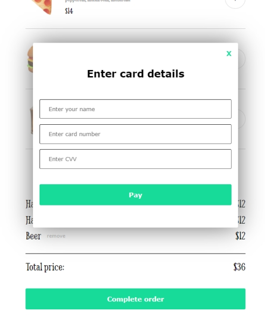
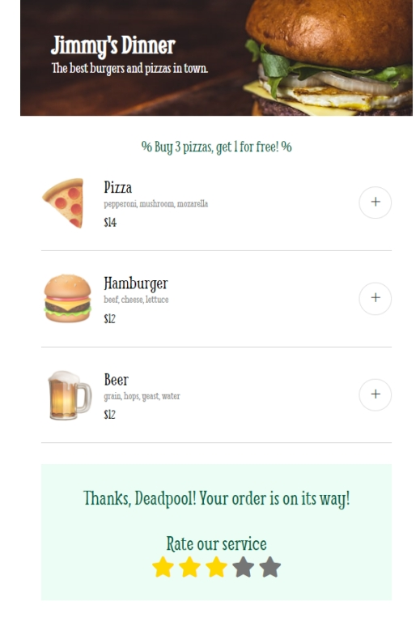

# Restaurant App

### Scrimba solo project

[netlify link]()

 
 

#### Requirements:
- follow the design spec [figma file](https://www.figma.com/file/Hdgwo69Dym9vVsxbuPbl0h/Mobile-Restaurant-Menu?node-id=0%3A1)
- render the menu options using JS
- be apble to add/remove items
- have a payment modal with compulsory form inputs

#### Stretch goals: 
- a "meal deal" discount
- allow users to rate their experience
